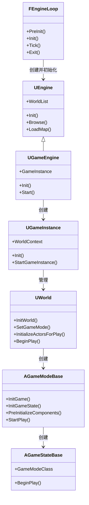

本目录包含关于 Unreal Engine 游戏框架的核心技术文档。

## 目录结构

1. **[01_游戏框架概述](./01_游戏框架概述.md)** - 概述UE游戏框架的整体架构
2. **[02_引擎启动流程](./02_引擎启动流程.md)** - FEngineLoop的PreInit和Init阶段
3. **[03_类加载与初始化顺序](./03_类加载与初始化顺序.md)** - 核心类的创建和初始化顺序
4. **[04_Actor生命周期](./04_Actor生命周期.md)** - Actor从Spawn到Destroy的完整生命周期
5. **[05_世界与关卡管理](./05_世界与关卡管理.md)** - UWorld、ULevel、WorldContext的关系

## 参考源码版本

基于 UE 5.4 (UnrealEngine-Angelscript-5.4.2) 源码分析。

## 核心类关系图

## 启动流程概览

| 阶段 | 关键操作 | 主要类 |
|------|----------|--------|
| PreInit | 加载模块、初始化子系统 | FEngineLoop |
| Init | 创建GEngine、GameInstance | UGameEngine, UGameInstance |
| LoadMap | 加载World、创建GameMode | UWorld, AGameModeBase |
| BeginPlay | 所有Actor开始游戏 | 所有Actor |